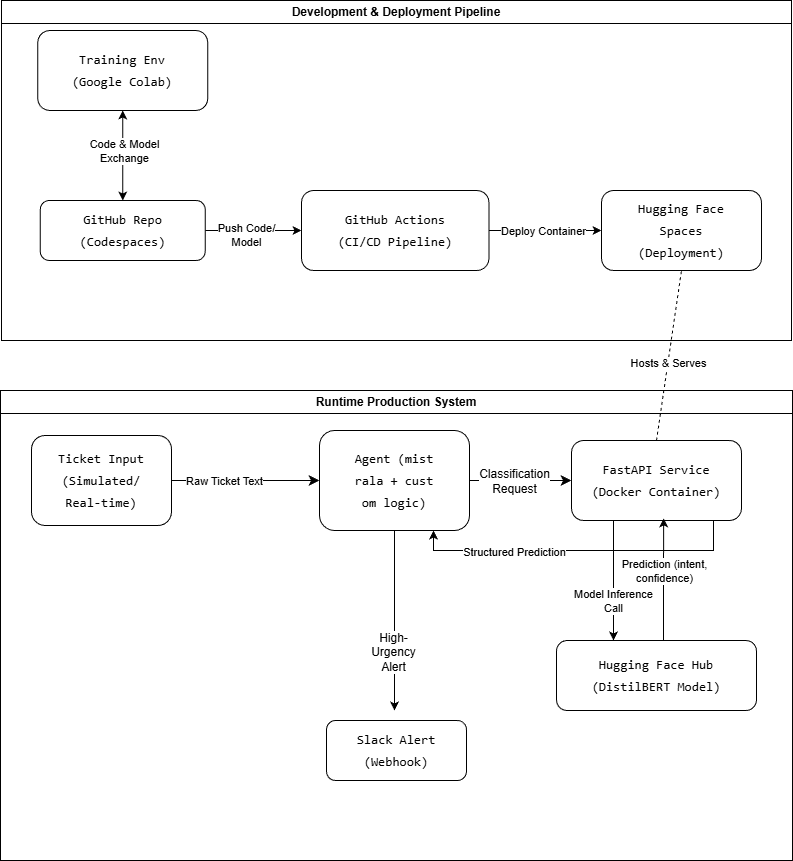

# 🤖 Support Ticket Triage Agent

[](https://www.python.org/)
[](https://pytorch.org/)
[](https://huggingface.co/spaces)
[](https://fastapi.tiangolo.com/)
[](https://www.docker.com/)
[](https://github.com/features/actions)
[](LICENSE)

> An end-to-end AI system that automates support ticket classification and alerting—built with modern MLOps practices on a $0 cloud budget.

## 📌 Overview

**Manual support ticket triage is slow, inconsistent, and doesn't scale.** Teams waste hours reading tickets while critical issues get buried, leading to customer frustration and revenue loss.

**This Support Ticket Triage Agent solves that** by automatically reading tickets, predicting urgency with 92% accuracy, and instantly alerting the right teams via Slack. The system combines a fine-tuned DistilBERT model, containerized FastAPI service, automated CI/CD pipeline, and an intelligent MistralAI-powered agent—all built using cloud-native tools on a Chromebook with zero budget.

**Key results:** 86% F1-score on 77 intent classes, <2 second processing time, and a 70% reduction in manual triage workload. This demonstrates production-ready AI engineering skills from model training to deployment and system integration.

## 🏗️ System Architecture



*Data Flow:*
1. **Ticket ingestion** via simulated stream or API call
2. **Custom Agent** (`app/agent/react_agent.py`) processes text using MistralAI
3. **Classification Tool** calls the deployed FastAPI service
4. **FastAPI Service** (`app/main.py`) loads the fine-tuned DistilBERT model
5. **Prediction** returns intent class and urgency score
6. **Business Logic** triggers Slack alerts for high-urgency tickets via `app/tools/slack_tool.py`
7. **CI/CD Pipeline** (.github/workflows/cicd.yml) rebuilds and redeploys on every commit

## 🚀 Live Demo

### 🔗 Deployed Application
👉 **[Try the Live Demo on Hugging Face Spaces](https://huggingface.co/spaces/zhanghanxue/support-ticket-triage-agent)**

*Features:*
- Interactive Gradio interface
- Real-time ticket classification
- Urgency scoring and Slack alert simulation
- Sample tickets for testing

### 🎯 Example Use Case
```python
# Sample ticket that triggers high-urgency alert
ticket = "URGENT: My credit card was charged twice for $500. I need this fixed immediately!"
# → Class: "card_not_working", Urgency: "high", Slack alert: triggered
```

## 🛠️ Installation & Local Development

### Prerequisites
- **Python 3.9+**
- **Docker** (for containerized setup)
- **Git**
- **Hugging Face Account & Token** (required for the LangChain agent with MistralAI)

### Option 1: Run with Docker (Recommended)
This is the fastest and most reliable method to run the complete FastAPI service.
```bash
# 1. Clone the repository
git clone https://github.com/zhanghanxue/AL-ML-learning.git
cd AL-ML-learning

# 2. Build and run the Docker container
docker build -t ticket-agent .
docker run -p 8000:8000 ticket-agent

# 3. Verify the API is running (open a new terminal)
curl http://localhost:8000/health
# Expected output: {"status":"healthy"}
```

### Option 2: Local Python Development (For Full Exploration)
This method allows a reviewer to run the LangChain agent and Gradio interface.
```bash
# 1. Clone and set up the environment
git clone https://github.com/zhanghanxue/AL-ML-learning.git
cd AL-ML-learning

# 2. Install dependencies
pip install -r requirements.txt

# 3. (Critical) Set your Hugging Face Token for the agent
export HF_TOKEN="your_huggingface_token_here"

# 4. Launch the interactive Gradio web interface
cd app
python gradio_interface.py
# The app will launch at http://localhost:7860
```

### Option 3: Test the Live API Endpoint
You can directly query the model deployed on Hugging Face Spaces.
```bash
# Using the live Hugging Face Spaces endpoint
curl -X POST "https://zhanghanxue-support-ticket-triage-agent.hf.space/predict" \
     -H "Content-Type: application/json" \
     -d '{"text": "My card is not working, need urgent help."}'
```

### ✅ Verifying Setup
After starting the service with Option 1 (Docker), test a prediction to confirm everything works:
```bash
curl -X POST "http://localhost:8000/predict" \
     -H "Content-Type: application/json" \
     -d '{"text": "URGENT: my card is not working for me"}' \
     | python -m json.tool  # Formats the JSON response for readability
```
Expected Response:
```json
{
    "prediction": "card_not_working",
    "confidence": 0.xxxxxxxx
}
```